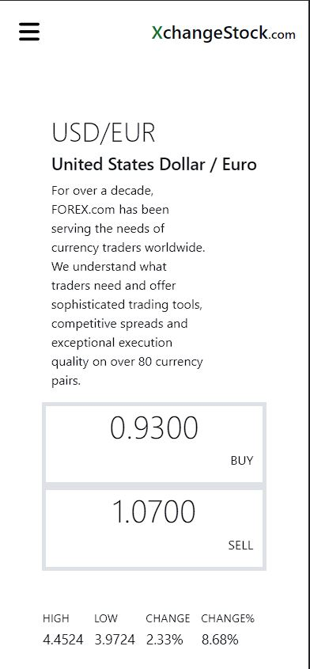
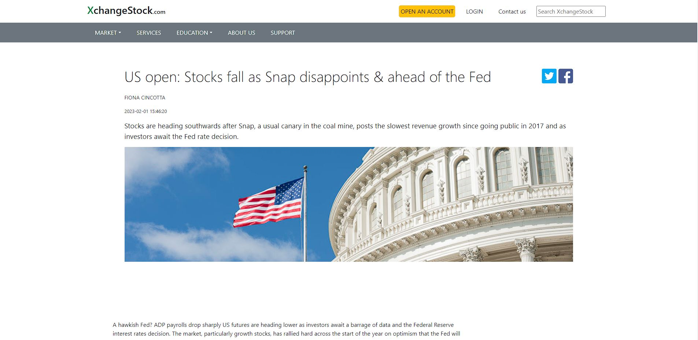

# XchangeStock

## Description
XchangeStock is a web application that allows users to view daily currency prices, explore historical currency charts, and stay updated with the latest news related to currencies. This application is built with PHP Laravel and SQL for the backend, while the frontend utilizes HTML, CSS, Bootstrap, JavaScript, and TypeScript.

## Features
- Daily Currency Prices: Users can access up-to-date currency prices and exchange rates for various currencies.
- Historical Currency Charts: Users can view historical charts that display the performance of currencies over time, allowing them to analyze trends and make informed decisions.
- Currency Converter: The application provides a currency converter tool that enables users to convert between different currencies.
- News and Updates: Users can read the latest news and updates related to currencies, providing valuable insights and market analysis.
- User Accounts: Users can create accounts, personalize their experience, and save preferences for future use.

## Mobile View
<table>
  <tr>
    <td valign="top"></td>
    <td valign="top"></td>
    <td valign="top"></td>
  </tr>
</table>

## Desktop View

### Home page

  

### Currency page

  

### Login page

  

### Calendar page

  

### News page

  

## Technologies Used

### Backend: 

- PHP Laravel: A popular PHP framework for building web applications.
- SQL: A relational database management system for storing and managing data.
- NBP WEB API: Api to get price of gold and other currencies.
### Frontend:
- HTML: Markup language for structuring web pages.
- CSS: Styling language for designing the application's appearance.
- Bootstrap: A CSS framework for building responsive and visually appealing web interfaces.
- JavaScript: A programming language for adding interactivity to web pages.
- TypeScript: A superset of JavaScript that adds static typing and additional features.

## License
This project is licensed under the MIT License. Feel free to use, modify, and distribute the code as permitted by the license.
